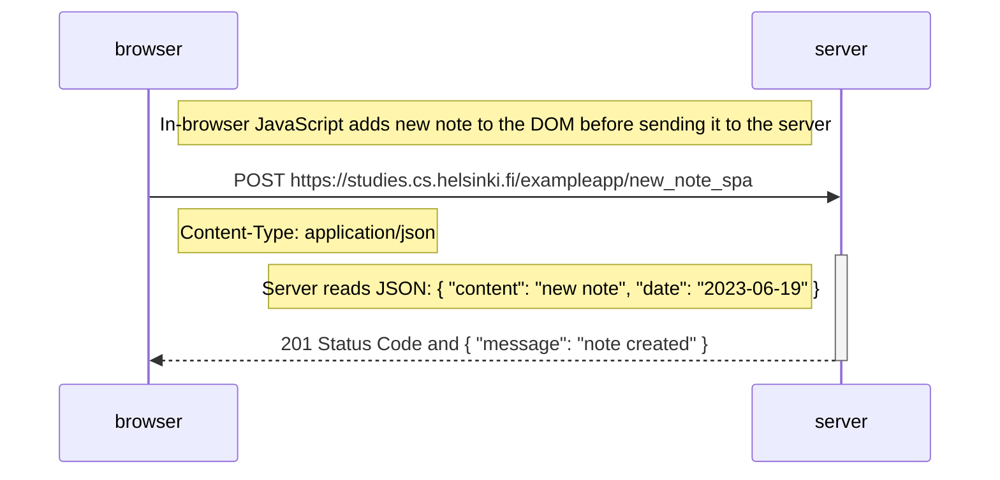

# New Note: SPA

```mermaid
sequenceDiagram
    participant browser
    participant server

    Note right of browser: In-browser JavaScript adds new note to the DOM before sending it to the server

    browser->>server: POST https://studies.cs.helsinki.fi/exampleapp/new_note_spa
    Note right of browser: Content-Type: application/json
    activate server
    Note left of server: Server reads JSON: { "content": "new note", "date": "2023-06-19" }
    server-->>browser: 201 Status Code and { "message": "note created" }
    deactivate server
```
